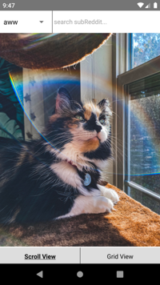

This is a project that I'm working on to learn react native with. The function of the app is pretty basic, it lets you search for subreddits that have pictures and it displays the pictures in an Instagram inspired layout. This only works for subreddits that have pictures which is the whole point of the app, to view pictures without all the text or hassle.

This gave me some more experience dealing with data in JSON format as I had to find where the url for the picture or gif was located. There was a lot of data per post and finding the picture link was easy but some gifs were a challenge to find the right working link. Majority of the time has been spent finding the right link which means I haven't spent much time working on the UI.

